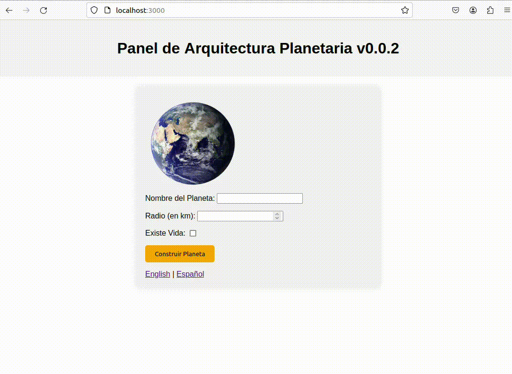

# TIN backend

+ a) show static files located on the server
+ b) show the entered data back in a nicely formatted way
+ c) non trivial sensible validation
+ c) success with template
+ c) failure page with error
+ d) show some data modification in a non trivial way
+ e) middlewares

## Demo



## Quickstart

To run the project:

```
cd tin-backend
npm start
```

Available at: http://localhost:3000
